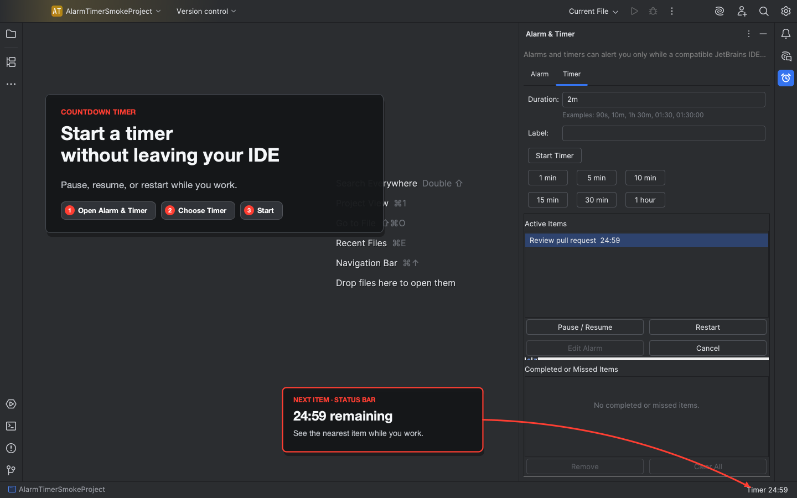
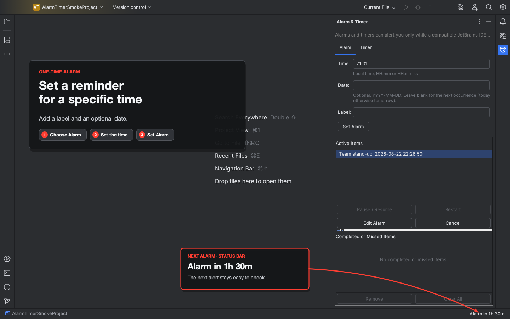
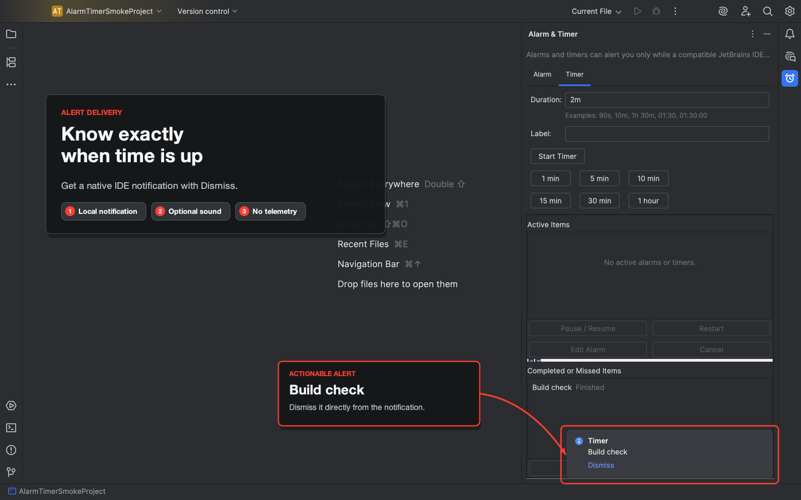
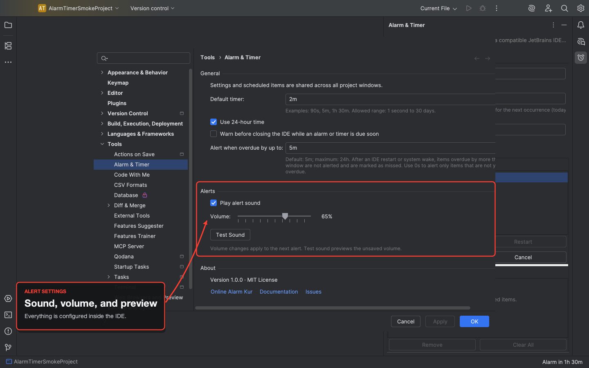

# Alarm and Timer for JetBrains IDEs

Set one-time alarms and run multiple countdown timers without leaving your JetBrains IDE. Alarms, timers, and settings belong to the IDE application, so they stay in sync across project windows.

Plugin ID: `com.onlinealarmkur.idea`

## Install

In your IDE:

1. Open **Settings/Preferences | Plugins | Marketplace**.
2. Search for **Alarm & Timer**.
3. Click **Install**.

To install a local build, open **Settings/Preferences | Plugins**, click the gear icon, choose **Install Plugin from Disk...**, and select the ZIP from `build/distributions/`. Do not unzip it first.

The minimum supported platform is JetBrains IntelliJ Platform 2025.2.

## Start an alarm or timer

1. Choose **Tools | Alarm & Timer | Open Alarm & Timer**. You can also use **View | Tool Windows | Alarm & Timer**.
2. Open the **Alarm** or **Timer** tab.
3. Enter a time or duration, then click **Set Alarm** or **Start Timer**.

The **Tools | Alarm & Timer** menu also has direct **Set an Alarm** and **Start a Timer** actions.

Use **Tools | Alarm & Timer | Alert Sound** to mute or unmute alerts. Volume and sound preview controls are under **Tools | Alarm & Timer | Settings...**. You can show or hide the countdown from the IDE's **Status Bar Widgets | Alarm & Timer** menu.

## Screenshots

| Countdown timers | One-time alarms |
|:--:|:--:|
| [](resources/marketplace/marketplace-timer.png) | [](resources/marketplace/marketplace-alarm.png) |
| Timer notification | Settings |
| [](resources/marketplace/marketplace-notification.png) | [](resources/marketplace/marketplace-settings.png) |

## What it does

- Sets a one-time alarm for a local time, optional date, and optional label. With no date, the plugin uses the next occurrence of that time.
- Runs several timers at once. Accepted inputs include `90s`, `10m`, `1h`, `1h 30m`, `01:30`, and `01:30:00`. Quick presets cover 1, 5, 10, 15, 30, and 60 minutes.
- Shows the nearest active item in the IDE status bar.
- Lets you edit or cancel alarms and pause, resume, restart, or cancel timers.
- Restores saved items after the IDE restarts and handles overdue items according to your recovery setting.
- Sends an IDE notification with a Dismiss action. Sound is optional, generated locally, and stops automatically.
- Uses the IDE language when it is English, Brazilian Portuguese, French, German, Japanese, Korean, Russian, Simplified Chinese, Spanish, or Turkish. Other locales fall back to English.

## Timing and recovery

> Alarms and timers can alert you only while a compatible JetBrains IDE is running. Minimizing the IDE does not stop alerts. Closing the IDE or system sleep delays delivery. Eligible overdue items are handled after startup or activation.

Do not use this plugin as the only alarm for medical, emergency, safety, or wake-up-critical events.

### Alarms

Alarm times accept 24-hour `HH:mm[:ss]` and 12-hour `h:mm[:ss] AM/PM` input. They use the IDE's local time zone. A local time that does not exist during a daylight-saving clock change is rejected. If a local time occurs twice, the plugin chooses the earliest occurrence that is still in the future.

### Timers

Unit input accepts hours, minutes, and seconds in that order, and each unit can appear once. In `mm:ss`, minutes can be any non-negative value and seconds must be below 60. In `hh:mm:ss`, minutes and seconds must both be below 60. A timer can run for one second to 30 days.

### Overdue items

The **Alert when overdue by up to** setting controls what happens after the IDE restarts or the computer wakes. An item inside that window alerts normally. An older item is marked **Missed** without playing an old alert. The default window is five minutes, the maximum is 24 hours, and `0s` permits an alert only while the item is still on time.

## Privacy and support

The plugin stores alarms, timers, and settings locally in the IntelliJ Platform application settings file `alarm-timer.xml`, with roaming disabled. It does not read project files or editor content, create an account, collect telemetry or analytics, download audio, or make automatic network requests. Documentation and website links open only when you click them.

Report ordinary bugs through [GitHub Issues](https://github.com/onlinealarmkur/jetbrains-alarm-timer/issues). For unexpected access to files, credentials, processes, or the network, use **Security | Report a vulnerability** in the GitHub repository. The latest Marketplace version is the supported version.

## Develop

The build requires JDK 25 and uses the checked-in Gradle wrapper. It emits Java 21 bytecode for the IntelliJ Platform 2025.2 minimum. Gradle downloads the IntelliJ Platform SDK and verification tools into its dependency cache when needed. It does not install IntelliJ IDEA, modify JetBrains Toolbox, or require a JetBrains account.

Run the fast tests while working:

```shell
./gradlew test
```

Run the IntelliJ platform tests when changing registration, persistence, or lifecycle behavior:

```shell
./gradlew platformTest
```

Before a release, run the complete unsigned check:

```shell
./gradlew --dependency-verification=strict clean verifyReleaseCandidate
```

This task compiles the plugin, runs both test tiers, checks the plugin configuration and ZIP structure, runs JetBrains Plugin Verifier, and writes the ZIP to `build/distributions/`.

If you change either release script, run ShellCheck too:

```shell
shellcheck scripts/validate-release.sh scripts/validate-release-test.sh
```

For an interactive check, `./gradlew runIdeSmoke` starts a separate development IDE with the plugin installed. The task uses Gradle's cached platform dependency. The development IDE can still perform its own compatibility lookups, so this task is not offline.

### Contributing

Keep business rules in `domain/` and `service/`; persistence belongs in `persistence/`; UI code belongs in `ui/`, `settings/`, and `actions/`. Add deterministic JUnit 5 tests and use injected clocks, schedulers, UI dispatchers, state savers, notification sinks, and sound backends. Do not add timing sleeps.

These identities are compatibility boundaries and must not change without a migration:

- Plugin ID and Gradle group: `com.onlinealarmkur.idea`
- Kotlin package: `com.onlinealarmkur.jetbrains`
- Persistent component: `com.onlinealarmkur.jetbrains.AlarmTimerState`
- State file: `alarm-timer.xml`

Labels remain unescaped in domain and persistence code and are escaped at the HTML notification boundary. Live timers use monotonic elapsed time. Alarms use wall time. Delivery acknowledgement is saved only after a notification is delivered, and concurrent alerts retain separate sound ownership.

<details>
<summary>Maintainer release guide</summary>

### Marketplace metadata

- Title: **Alarm & Timer**
- Short description: **Set one-time alarms and time-based reminders, or run multiple countdown timers inside your JetBrains IDE.**
- Plugin ID: `com.onlinealarmkur.idea`
- Vendor: `onlinealarmkur.com`
- Homepage: `https://onlinealarmkur.com/en/`
- Documentation and source: `https://github.com/onlinealarmkur/jetbrains-alarm-timer`
- Issues: `https://github.com/onlinealarmkur/jetbrains-alarm-timer/issues`
- License: MIT
- Channel: Stable
- Tags: Productivity, Time Management
- Pricing: Free

Upload the four 1440 x 900 images in `resources/marketplace/` in this order: `marketplace-timer.png`, `marketplace-alarm.png`, `marketplace-notification.png`, and `marketplace-settings.png`. Use `resources/github-social-preview.png` as the GitHub social preview. The packaged Marketplace icons are `src/main/resources/META-INF/pluginIcon.svg` and `pluginIcon_dark.svg`.

Check the current [JetBrains Marketplace listing guidance](https://plugins.jetbrains.com/docs/marketplace/best-practices-for-listing.html) before the first upload.

### One-time setup

1. Create the public repository as `onlinealarmkur/jetbrains-alarm-timer`. Review its history and enable private vulnerability reporting.
2. Sign in to JetBrains Marketplace, accept its terms, declare the applicable trader status, and create or select the `onlinealarmkur.com` vendor profile.
3. Follow the [JetBrains Plugin Signing guide](https://plugins.jetbrains.com/docs/intellij/plugin-signing.html) to generate a private key and certificate chain. Keep an offline backup and never commit either file.
4. In **GitHub | Settings | Environments**, create `plugin-signing` and restrict it to protected tags matching `*.*.*`. Add `PRIVATE_KEY`, `PRIVATE_KEY_PASSWORD`, and `CERTIFICATE_CHAIN`. Store the key and certificate chain as Base64-encoded PEM values. Do not add a Marketplace publishing token.
5. The release workflow requires the repository owner to be `onlinealarmkur` and the tag-pushing GitHub account to be `ozdemirburak`. Update that boundary deliberately if either identity changes.

### Release a version

1. Set `pluginVersion` in `gradle.properties` to a stable `MAJOR.MINOR.PATCH` version. Add its dated changelog heading and release link below.
2. Update `MARKETPLACE_CHANGE_NOTES.html`. The first line must be `<!-- version: <pluginVersion> -->`. Put the Marketplace HTML after that line, then copy its text under **Release notes for <pluginVersion>** below.
3. Fetch tags, commit the release source, leave the worktree clean, and run:

   ```shell
   scripts/validate-release.sh identity <pluginVersion>
   shellcheck scripts/validate-release.sh scripts/validate-release-test.sh
   ./gradlew --dependency-verification=strict clean verifyReleaseCandidate
   scripts/validate-release.sh archive <pluginVersion> unsigned
   ```

4. Install that unsigned ZIP in IntelliJ IDEA Community and at least one compatible non-IDEA product. Check alarm and timer delivery, minimized behavior, overdue recovery, dynamic disable and enable, 12-hour and 24-hour display, the status widget, simultaneous alerts, all sound controls, settings navigation, one Latin translation, one CJK translation, and English fallback. Open every public URL in a signed-out browser. Take screenshots from this build only.
5. Push `main`, then create the authorization tag:

   ```shell
   git tag -a <pluginVersion> -m "<pluginVersion>"
   git push origin <pluginVersion>
   ```

6. GitHub Actions verifies that the tag belongs to `main`, runs the complete unsigned check without secrets, attests the ZIP and checksum, and transfers those exact files to the `plugin-signing` job. The signing job checks the files, decodes the credentials on its temporary runner, signs without rebuilding, verifies the signature, attests the signed files, and stores `alarm-and-timer-<pluginVersion>` for 90 days.
7. A separate job with no signing secrets creates a draft GitHub release, attaches that exact signed ZIP and checksum, downloads and byte-compares both assets, verifies the checksum, and publishes the GitHub release only after every check passes.
8. Download `jetbrains-<pluginVersion>-signed.zip` from the GitHub release or its retained Actions artifact. Verify `jetbrains-<pluginVersion>-signed.zip.sha256` with `sha256sum --check` on Linux or `shasum -a 256 -c` on macOS. Upload the signed ZIP manually to JetBrains Marketplace. Do not rebuild, rename, or sign it again. Never move a release tag; use a new version if the source changes.

The workflow automatically creates the GitHub release but never publishes to JetBrains Marketplace. Review dependency updates, Gradle wrapper changes, Kotlin and JDK changes, IntelliJ Platform updates, action pins, and dependency verification metadata before every release.

</details>

## Release notes for 1.0.0

Initial release with one-time alarms, multiple countdown timers, and a status-bar view of the next deadline. Alarms support 12-hour and 24-hour time. The plugin restores application-wide state, handles overdue items using a configurable recovery window, sends IDE notifications, and can play a procedural alert sound. The interface is available in ten languages.

## Changelog

### [Unreleased]

### [1.0.0] - 2026-08-25

#### Added

- One-time alarms with optional dates and labels.
- Multiple timers with flexible input, six presets, pause, resume, restart, and cancel controls.
- A status-bar countdown for the nearest active item.
- Application-wide persistence, overdue recovery, notifications, and optional local sound.
- English, Brazilian Portuguese, French, German, Japanese, Korean, Russian, Simplified Chinese, Spanish, and Turkish interfaces.

[Unreleased]: https://github.com/onlinealarmkur/jetbrains-alarm-timer/compare/1.0.0...HEAD
[1.0.0]: https://github.com/onlinealarmkur/jetbrains-alarm-timer/releases/tag/1.0.0

## License

The source and documentation use the [MIT License](LICENSE). The Online Alarm Kur name, logo, and icon artwork are reserved brand assets and are not licensed for another product or service. The plugin includes its icons so JetBrains IDEs can display them. Maintained by Burak Ozdemir.
